# Quiz

This is a simple quiz game implemented with HTML, CSS and JavaScript. The game displays 20 multiple-choice questions to the user, tracks their score, and displays the final score at the end of the game. View the live site [here](https://0-ana.github.io/quiz/)

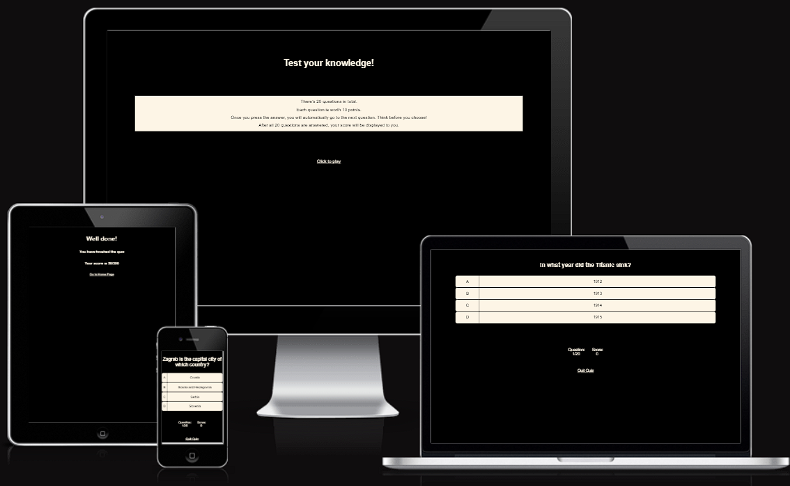

## Features

### Home Page

- contains:
  - favicon & title
  - h1 title
  - game instructions 
  - link to start the game

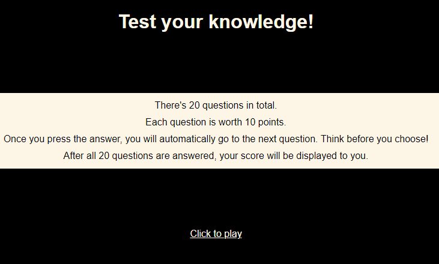

### Game Page

- contains:
  - favicon & title
  - question
  - four possible answers 
  - question counter
  - score counter
  - link to quit quiz

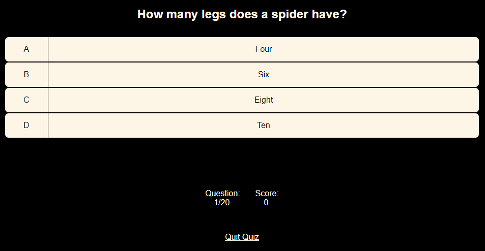

### End Page

- contains:
  - favicon & title
  - h1 & h3 title
  - final score display 
  - link to home page

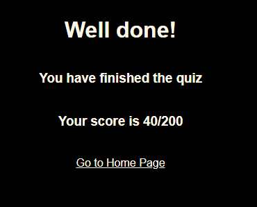

## Technologies

- HTML
  - The structure of the Website was developed using HTML as the main language.
- CSS
  - The Website was styled using custom CSS in a external file.
- JS
  - The user interaction on the site was made using custom JS in a external file.
- Gitpod
  - The website was developed using Gitpod.
  - Gitpod was used to commit and push code to GitHub.
- GitHub
  - Source code is hosted on GitHub
  - Webpage is deployed using from Github
- Favicon
  - Favicon files were created at https://favicon.io/favicon-converter/ 
- Google Fonts
  - Text was styled using fonts from https://fonts.google.com/
- Balsamiq Wireframes
  - wireframes were created using balsamiq from https://balsamiq.com/wireframes/desktop/#

## Wireframes 

Balsamiq Wireframes were used as the initial idea for design of the website

- Home Page

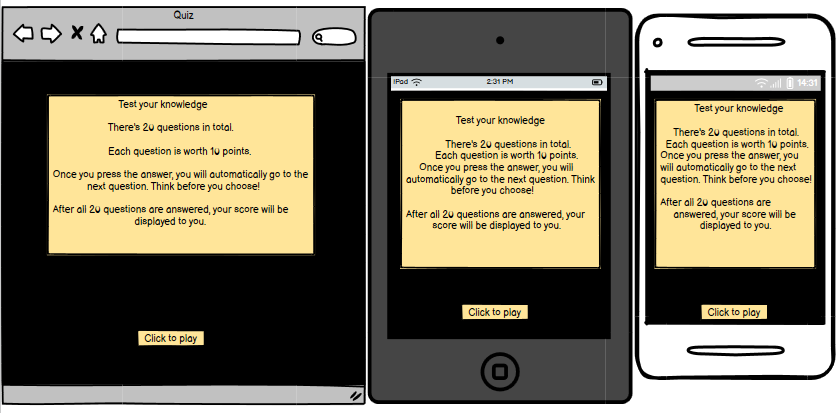

- Game Page

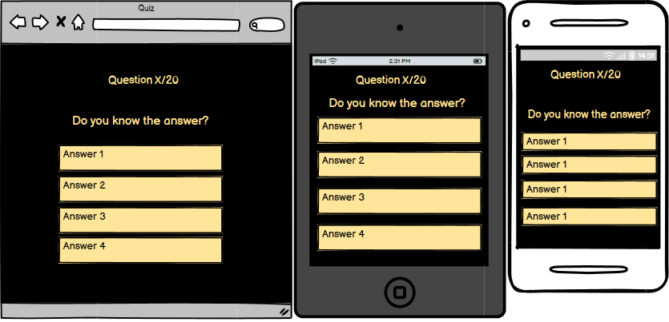

- End Page

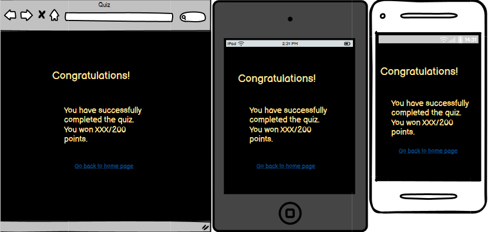

## Testing

- All pages were tested to ensure responsiveness on screen sizes from 280px and upwards
- the website works as planned on all screen sizes
- testing on all three pages was performed using:
  - HTML validator https://validator.w3.org/

  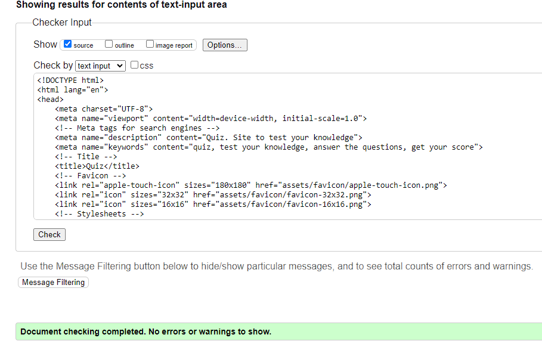
  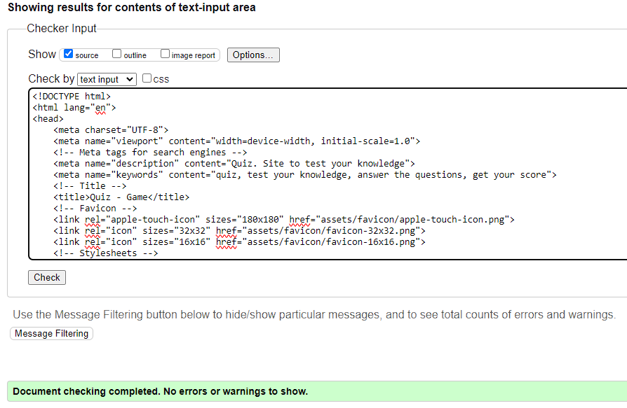
  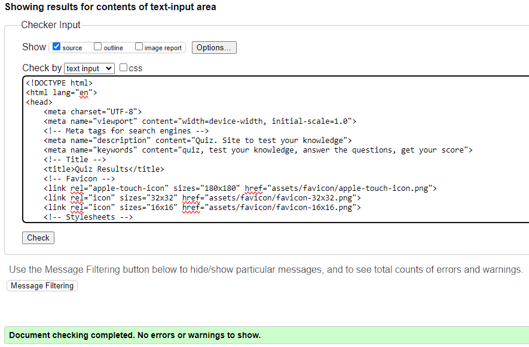

  - CSS validator https://jigsaw.w3.org/css-validator/

  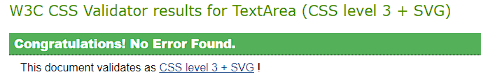

  - JS validator https://jshint.com/

  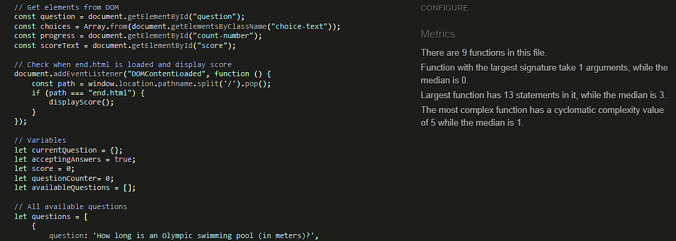

  - lighthouse in dev tools

  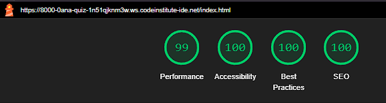

  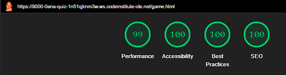
  
  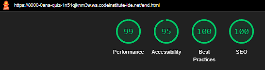

  - accessibility https://wave.webaim.org/

  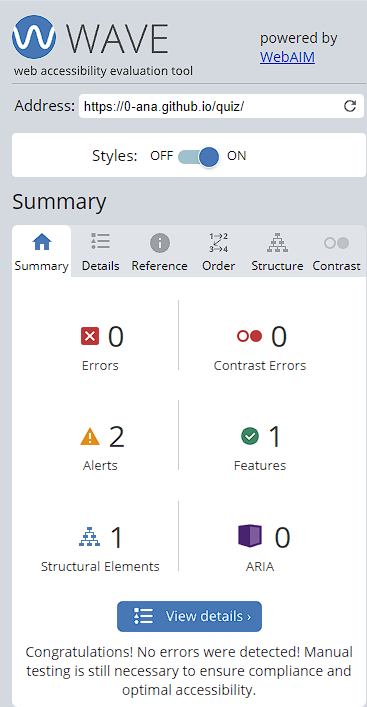
  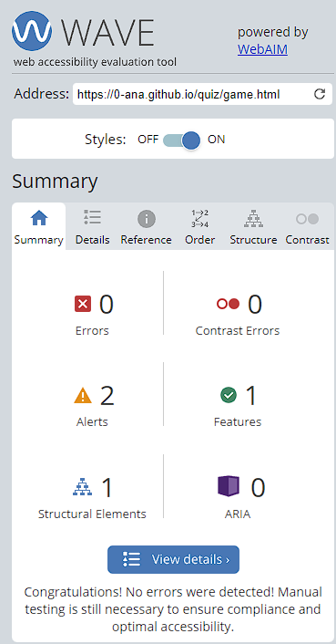
  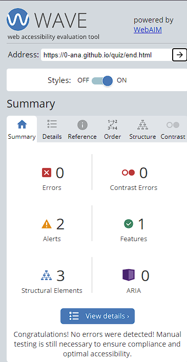

